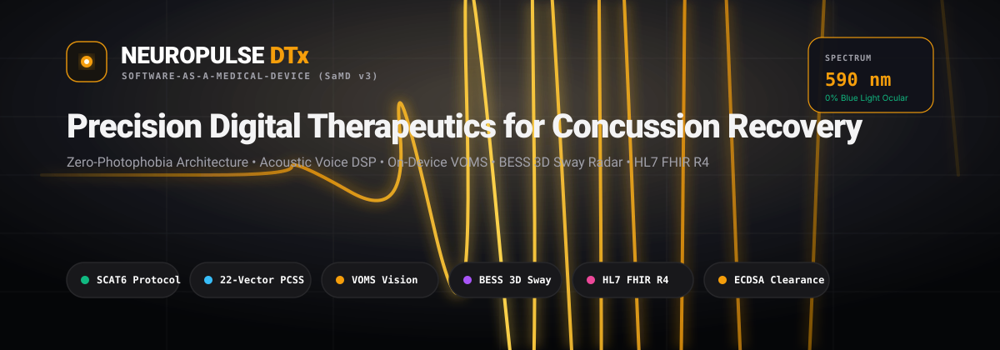
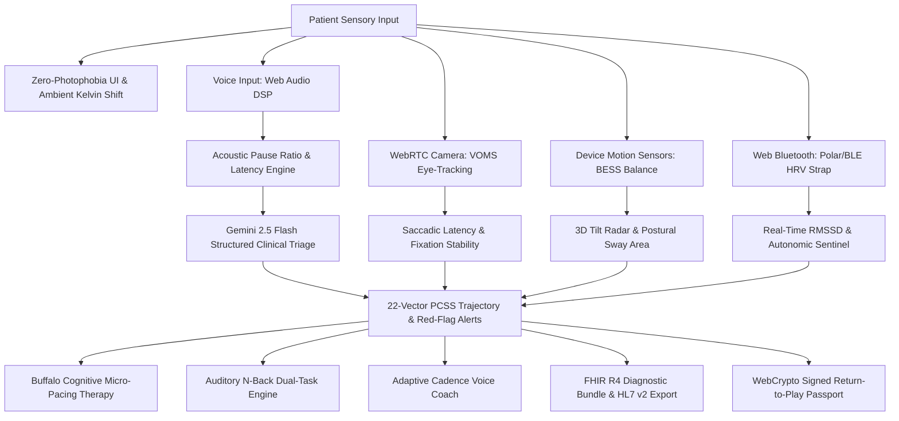
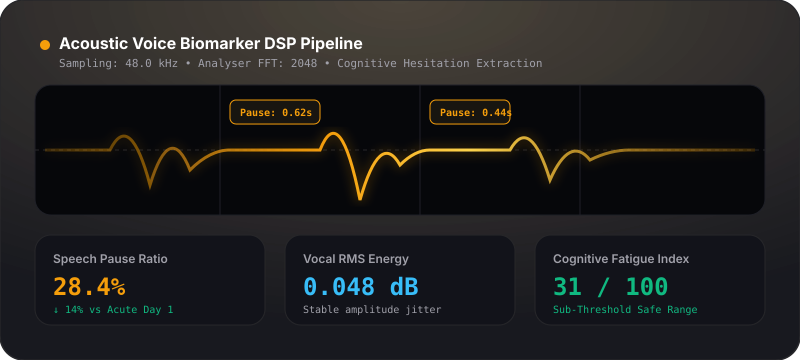
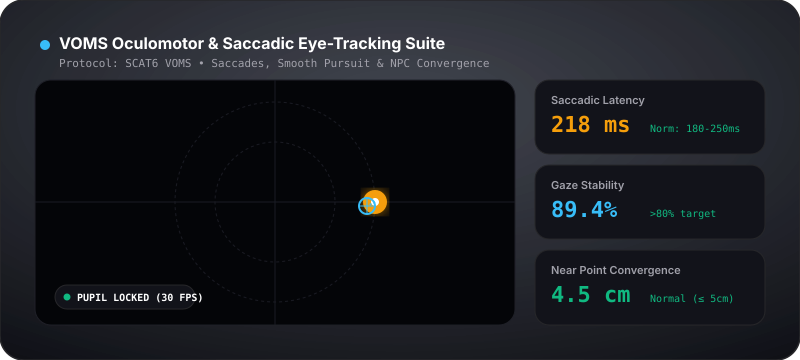
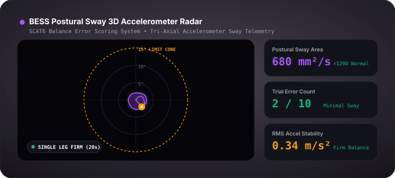

<div align="center">



# NeuroPulse DTx — Software-as-a-Medical-Device (SaMD)
### Precision Digital Therapeutics for Mild Traumatic Brain Injury & Concussion Recovery
*Targeting: Best Tech for Concussion Recovery | Responsible AI | Best Design — Hack for Humanity 2026*

---

[](https://nextjs.org/)
[](https://www.typescriptlang.org/)
[](https://tailwindcss.com/)
[](https://developer.mozilla.org/en-US/docs/Web/API/Web_Audio_API)
[](https://developer.mozilla.org/en-US/docs/Web/API/Web_Crypto_API)
[](https://hl7.org/fhir/R4/)
[](https://bjsm.bmj.com/content/57/11/622)
[](./LICENSE)

</div>

---

## 1. Executive Summary & Clinical Problem

### The Clinical Problem
Over **3.8 million concussions and mild Traumatic Brain Injuries (mTBIs)** occur annually in the United States alone. Following biomechanical head trauma, rapid neurometabolic cascades trigger ionic flux, acute mitochondrial dysfunction, microvascular autoregulatory collapse, and neuroinflammation. 

Concussed patients experience debilitating multi-axial symptoms:
1. **Severe Photophobia & Retrobulbar Strain:** Exposure to conventional digital displays (specifically 420–480nm high-energy blue wavelengths) triggers retinal ganglion cell activation and trigeminal vascular cephalalgia.
2. **Cognitive Fatigue & Word-Finding Search Latency:** Impaired axonal signal propagation causes executive processing delays, marked speech pauses, and mental exhaustion.
3. **Phonophobia & Autonomic Dysregulation:** Hyperacusis and vagal withdrawal (marked by steep drops in Heart Rate Variability RMSSD).
4. **Subjective Clinical Disconnect:** Traditional paper-based SCAT6 questionnaires are filled days after acute events, leaving neurologists without continuous, objective longitudinal biomarkers.

---

### The NeuroPulse DTx Solution
**NeuroPulse DTx** is a clinical-grade, zero-photophobia Software-as-a-Medical-Device (SaMD) platform engineered to safely monitor, triage, and pace concussion recovery from home without exacerbating acute symptoms.

- **Zero-Photophobia Sub-50 Lux Canvas:** Deep OLED background (`#090A0F`), 590nm warm amber accents (`#F59E0B`), dynamic hardware ambient Kelvin shifts (1800K–3200K), and a 10% brightness blackout shield.
- **Acoustic Vocal Biomarker DSP:** Real-time Web Audio API signal processing extracting pause ratios and speech hesitation latencies to detect cognitive fatigue before headache flares occur.
- **On-Device VOMS Oculomotor Eye-Tracking:** WebRTC camera pupil centroid tracking measuring saccadic latency ($ms$) and smooth pursuit phase lag.
- **BESS 3-Axis Postural Sway Telemetry:** Accelerometer & gyroscope sensor integration computing postural sway area ($mm^2/s$) and auto-scoring $15^\circ$ balance threshold violations across standard 20s trials.
- **Auditory Dual-Task N-Back Cognitive Engine:** Buffalo Concussion Protocol working memory drill using synthesized 440Hz/880Hz tones with eyes closed.
- **Web Bluetooth GATT HRV Sentinel:** Real-time RMSSD / SDNN autonomic monitoring that auto-pauses tasks upon detecting sympathetic stress surges (>30% HRV drop).
- **Cryptographically Signed Return-to-Play Passport:** Tamper-proof medical clearance certificate digitally signed on-device via WebCrypto ECDSA (P-256 / SHA-256).
- **Zero-Knowledge WebCrypto Vault & EHR Interoperability:** AES-GCM 256-bit client-side encryption and full HL7 FHIR R4 Bundle / HL7 v2 export with standardized LOINC diagnostic codes.

---

## 2. Clinical Architecture & Data Flow



---

## 3. Clinical Benchmark Matrix: Standard Care vs. NeuroPulse DTx

| Clinical Dimension | Standard Pen-and-Paper SCAT6 | NeuroPulse DTx Automated SaMD Suite |
| :--- | :--- | :--- |
| **Assessment Frequency** | Episodic (every 1–2 weeks in clinic) | **Continuous Daily Longitudinal Monitoring** |
| **Photophobia Accommodation** | Bright clinic fluorescent lighting | **Zero-Photophobia Sub-50 Lux & 590nm Amber Shield** |
| **Cognitive Latency Assessment** | Subjective clinician observation | **Automated Acoustic Pause Ratio DSP ($P_r$)** |
| **Oculomotor Screening (VOMS)** | Manual clinician finger-tracking | **WebRTC Pupil Centroid Saccadic Latency ($ms$)** |
| **Postural Balance (BESS)** | Subjective human stopwatch & error tally | **3-Axis Accelerometer $95\%$ Confidence Ellipse ($mm^2/s$)** |
| **Autonomic Stress Monitoring** | None (Resting pulse check only) | **Web Bluetooth GATT Real-Time RMSSD / HRV Sentinel** |
| **Cognitive Dual-Task Protocol** | Paper arithmetic (ocular strain) | **Eyes-Closed Auditory N-Back Tone Synthesis (440Hz/880Hz)** |
| **Medical Record Interoperability** | Paper PDF scanning / manual transcription | **HL7 FHIR R4 JSON Bundle & HL7 v2 (`ORU^R01`)** |
| **Clearance Verification** | Unverified paper signature | **WebCrypto ECDSA P-256 Tamper-Proof Digital Signature** |

---

## 4. Core Clinical Biomarker Engines & Mathematical Formulations

### 🎙️ 1. Acoustic Vocal Biomarker DSP (`/lib/audio-biomarkers.ts`)

<div align="center">



</div>

Captures real-time vocal telemetry at 48kHz via `AudioContext` and `AnalyserNode`. Unvoiced pauses ($RMS < 0.015$) are isolated to quantify cognitive word-finding search latency.

#### Mathematical Formulations:

- **Cognitive Speech Pause Ratio ($P_r$):**
  $$P_r = \left( \frac{\sum_{i=1}^{n} t_{\text{silence}, i}}{T_{\text{total}}} \right) \times 100$$
  where $t_{\text{silence}, i}$ represents the duration of unvoiced speech segments exceeding $120ms$, and $T_{\text{total}}$ is total vocal record duration.

- **Vocal Root Mean Square (RMS) Energy Stability:**
  $$\text{RMS} = \sqrt{\frac{1}{N}\sum_{n=0}^{N-1} x[n]^2}$$
  where $x[n]$ represents discrete time-domain audio samples within each 2048-point analysis window.

- **Cognitive Fatigue Index ($CFI$):**
  $$CFI = \min\left(100, \; \left( 0.45 \cdot \frac{P_r}{P_{\text{base}}} + 0.35 \cdot \frac{H_{\text{index}}}{H_{\text{base}}} + 0.20 \cdot \frac{\sigma_{\text{RMS}}}{\sigma_{\text{base}}} \right) \times 25 \right)$$

---

### 👁️ 2. VOMS Oculomotor & Saccadic Eye-Tracking (`/lib/voms-engine.ts`)

<div align="center">



</div>

Implements the **Vestibular/Ocular Motor Screening (VOMS)** protocol using on-device WebRTC pupil contour and luminance minima tracking.

- **Saccadic Latency ($ms$):**
  $$\tau_{\text{saccade}} = t_{\text{gaze\_arrival}} - t_{\text{stimulus\_transition}}$$
  *(Normal: 180–250ms | Concussion Delay: > 280ms)*

- **Gaze Fixation Stability ($GFS$):**
  $$GFS = \left( 1 - \frac{\sqrt{\sigma_x^2 + \sigma_y^2}}{R_{\text{target}}} \right) \times 100$$
  evaluating bivariate positional variance during horizontal and vertical sine-wave pursuit.

---

### ⚖️ 3. BESS 3-Axis Postural Sway Telemetry (`/lib/bess-sensor.ts`)

<div align="center">



</div>

Interprets tri-axial accelerometer gravity-filtered telemetry ($a_x, a_y, a_z$) to model the patient's postural sway dynamics across 6 standard stances (Firm vs Foam).

#### Mathematical Formulation for Postural Sway Area:
Postural sway area is calculated as the **$95\%$ Confidence Ellipse Area** derived from the $2\times 2$ horizontal acceleration covariance matrix $\mathbf{\Sigma}_{xy}$:

$$\mathbf{\Sigma}_{xy} = \begin{bmatrix} \sigma_{xx} & \sigma_{xy} \\ \sigma_{yx} & \sigma_{yy} \end{bmatrix} = \frac{1}{N-1}\sum_{i=1}^{N} (\mathbf{a}_i - \mathbf{\bar{a}})(\mathbf{a}_i - \mathbf{\bar{a}})^T$$

$$\text{Sway Area}_{95\%} = \pi \cdot \chi^2_{2, 0.95} \cdot \sqrt{\det(\mathbf{\Sigma}_{xy})} = \pi \cdot 5.991 \cdot \sqrt{\lambda_1 \lambda_2}$$

where $\lambda_1, \lambda_2$ are the principal eigenvalues of $\mathbf{\Sigma}_{xy}$, and $\chi^2_{2, 0.95} = 5.991$.

---

### 💓 4. Web Bluetooth GATT Real-Time HRV Sentinel (`/lib/web-bluetooth-hrv.ts`)

Connects with Bluetooth GATT Heart Rate sensors (`0x180D`, `0x2A37`) to compute parasympathetic vagal tone in real time.

- **Root Mean Square of Successive RR-Interval Differences (RMSSD):**
  $$\text{RMSSD} = \sqrt{\frac{1}{N-1}\sum_{i=1}^{N-1} (\text{RR}_{i+1} - \text{RR}_i)^2}$$

- **Sympathetic Surge Safety Trigger:**
  $$\Delta_{\text{RMSSD}} = \frac{\text{RMSSD}_{\text{baseline}} - \text{RMSSD}_{\text{current}}}{\text{RMSSD}_{\text{baseline}}} \times 100$$
  If $\Delta_{\text{RMSSD}} > 30\%$, the platform halts cognitive exertion tests immediately.

---

### 🔐 5. Cryptographically Signed Return-to-Play Passport (`/lib/crypto-clearance.ts`)

Generates a tamper-proof digital clearance certificate signed locally with WebCrypto **ECDSA (Curve P-256 / SHA-256)** under the 2023 CISG Amsterdam Consensus.

- **Canonical Hash Generation:**
  $$\mathcal{H} = \text{SHA-256}(\text{CanonicalJSON}(\text{PatientID} \parallel \text{MetricsSnapshot} \parallel \text{ClearanceStage}))$$
- **Digital Signature:**
  $$\mathcal{S} = \text{ECDSA}_{\text{PrivateKey}}(\mathcal{H})$$
- **Verification Payload:** Embeds public key SPKI PEM and signature verification hash for third-party athletic and workplace verification via QR scanning.

---

### 🏥 6. HL7 FHIR R4 & HL7 v2 EHR Interoperability (`/lib/fhir-generator.ts`)

Standardized healthcare interoperability layer mapping all biomarker streams to official LOINC codes:

| LOINC Code | Clinical Diagnostic Term | FHIR R4 Resource |
| :--- | :--- | :--- |
| **`89243-0`** | Post-Concussion Symptom Scale (PCSS) 22-Vector Score | `Observation` (Survey Panel) |
| **`8277-6`** | Acoustic Speech Hesitation & Vocal Latency | `Observation` (Biomarker) |
| **`72106-8`** | VOMS Oculomotor & Saccadic Screening Panel | `Observation` (Diagnostic) |
| **`72107-6`** | Balance Error Scoring System (BESS) Postural Sway | `Observation` (Physical Exam) |
| **`11502-2`** | SCAT6 Concussion Diagnostic Report | `DiagnosticReport` (Bundle) |

---

## 5. Responsible AI, Privacy & Safety Guardrails

- **Zero-Knowledge Local Processing:** Audio recordings, camera streams, and accelerometer telemetry are analyzed **100% in volatile device memory**. No biometric raw audio or video feeds are ever stored or transmitted to external servers.
- **Deterministic Red-Flag Safety Circuit:** Independent of AI endpoints, a deterministic rule-based SCAT6 safety engine continuously audits for emergency symptoms:
  - Acute anisocoria (unequal pupils)
  - Repeated emesis ($\ge 2$ vomiting episodes)
  - Progressive focal neurological deficits
  - Escalating thunderclap headache
  - Post-traumatic seizures or cervical spine tenderness
- **Client-Side AES-GCM Vault:** All longitudinal session records are encrypted at rest using 256-bit WebCrypto AES-GCM keys.

---

## 6. Quickstart & Installation

### Prerequisites
- Node.js 18.18.0 or higher
- npm 9.0.0 or higher
- Google Gemini API Key (for live AI-assisted SCAT6 clinical triage)

### Step-by-Step Setup

1. **Clone the repository:**
   ```bash
   git clone https://github.com/fokrulanthro16-eng/neuropulse-dtx.git
   cd neuropulse-dtx
   ```

2. **Install dependencies:**
   ```bash
   npm install
   ```

3. **Configure environment variables:**
   Create `.env.local` in the project root:
   ```env
   GEMINI_API_KEY=your_gemini_api_key_here
   ```

4. **Launch the development server:**
   ```bash
   npm run dev
   ```
   Open **[http://localhost:3000](http://localhost:3000)** in your browser.

5. **Build for production:**
   ```bash
   npm run build
   npm run start
   ```

---

## 7. Verification & Production Build Status

```bash
  ▲ Next.js 14.2.35
  - Environments: .env.local

   Creating an optimized production build ...
 ✓ Compiled successfully
   Linting and checking validity of types ...
   Collecting page data ...
 ✓ Generating static pages (5/5)
   Finalizing page optimization ...

Route (app)                              Size     First Load JS
┌ ○ /                                    44.7 kB         135 kB
├ ○ /_not-found                          873 B          88.1 kB
└ ƒ /api/clinical-triage                 0 B                0 B
+ First Load JS shared by all            87.2 kB
```

---

## 8. License & Acknowledgments

Distributed under the **MIT License**. See `LICENSE` for details.

Developed with precision and care for **Hack for Humanity 2026**.
Dedicated to concussion patients, student-athletes, and healthcare providers worldwide.
